# NyAI-Lens

An AI-powered analysis tool for Indian court judgments(Specialized more for Supreme Court Judgements). Upload a Supreme Court or High Court PDF and instantly get structured metadata, paragraph-level rhetorical classification, legal entity highlighting, conversational Q&A, and similar case search.

---

## Features

### PDF Ingestion & Extraction

Converts a judgment PDF into clean structured text — metadata, numbered paragraphs, and a signature footer — using `pymupdf4llm` with OCR fallback for scanned pages.

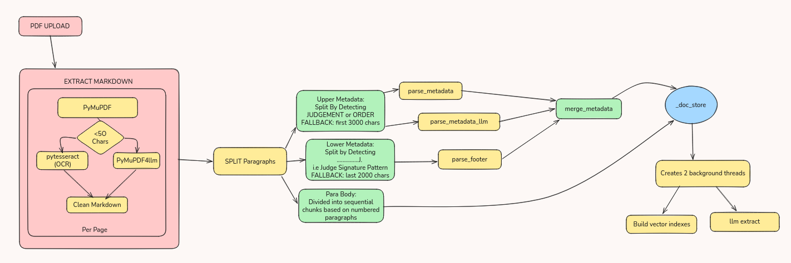

---

### Metadata Extraction

Extracts structured metadata (citation, court, parties, judges, date, jurisdiction) from the judgment header using both regex and LLM extraction, merged with LLM-primary fallback.

**Demo**

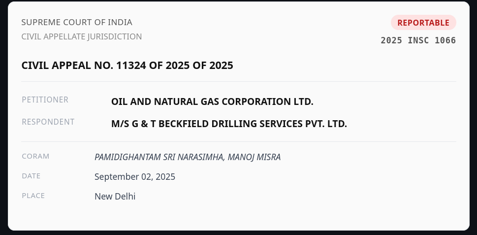

---

### Rhetorical Classification

Tags each paragraph with its legal role (Facts, Ratio Decidendi, Arguments, Disposition, etc.) using a streaming LLM pipeline with concurrent paragraph processing.

**Flow**

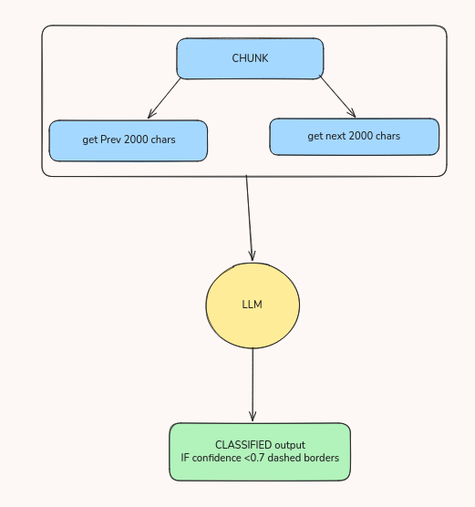

**Demo**

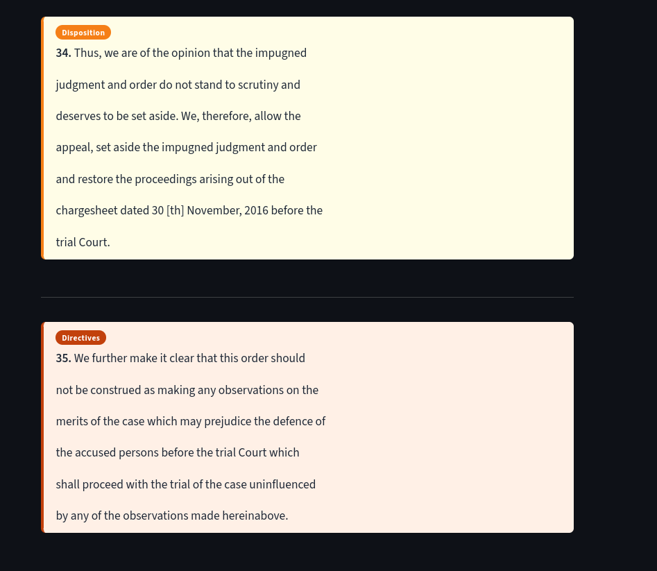

---

### Agentic RAG Chat

A multi-step chat system that plans which tools to call (metadata lookup, summary retrieval, dense+BM25 paragraph search), streams the answer token by token, and runs citation and faithfulness checks.

**Flow**

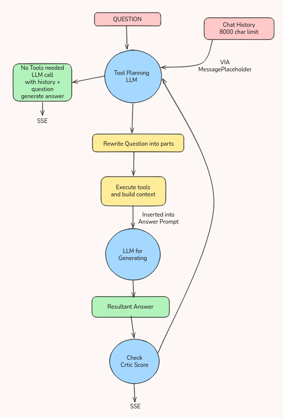

**Demo**

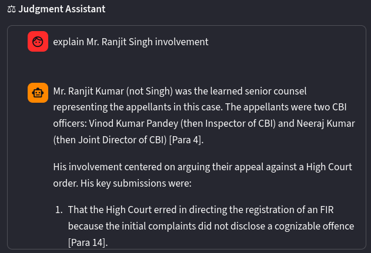
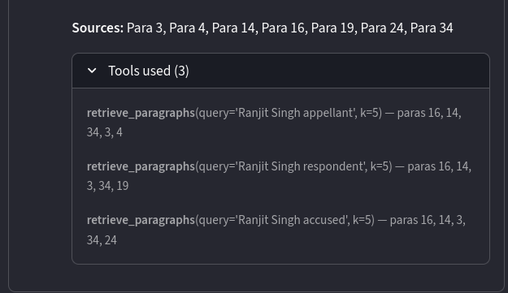

---

### Similar Case Search

Finds the top-5 most legally similar judgments in a pre-indexed Qdrant database using three semantic vectors (ratio, facts, full), NER-based entity overlap (Jaccard on provisions/statutes/precedents), and cross-encoder reranking.

**Flow**

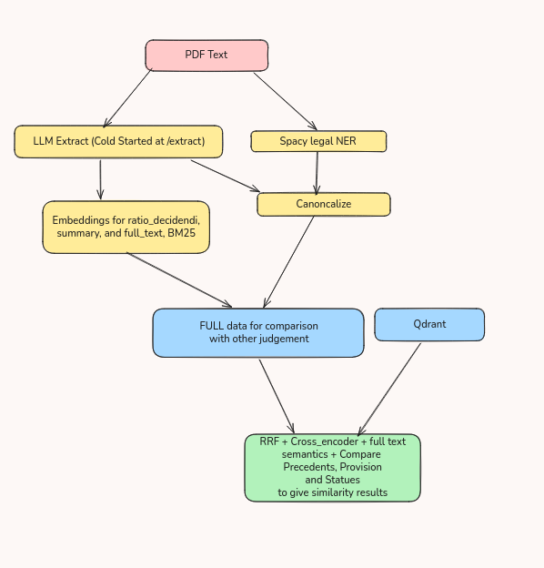

**Demo**

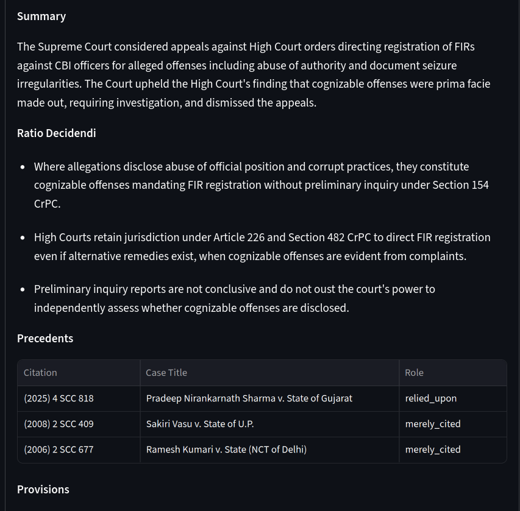
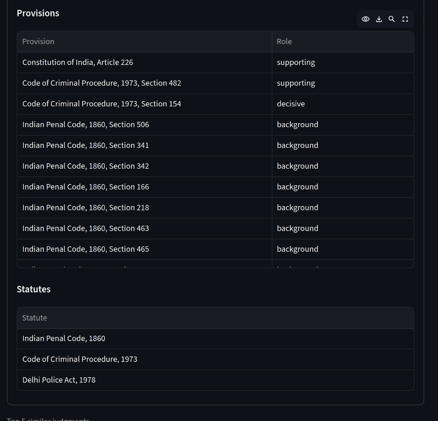
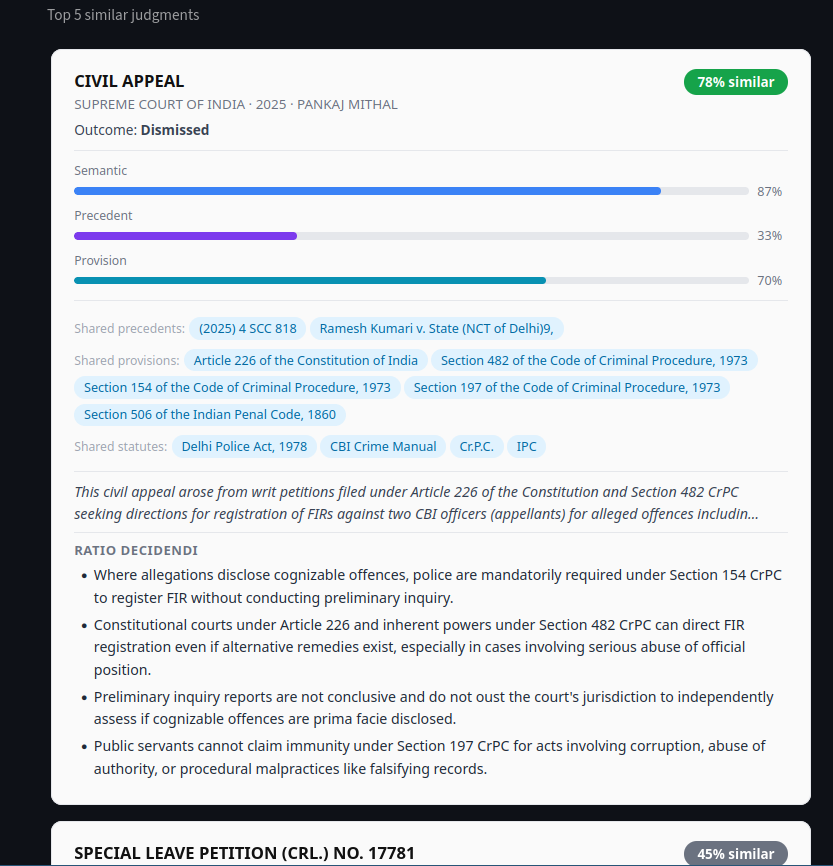

---

### Legal NER Highlighting

Extracts and highlights legal named entities — provisions, statutes, and precedents — using a spaCy transformer model fine-tuned on Indian court documents.

**Demo**

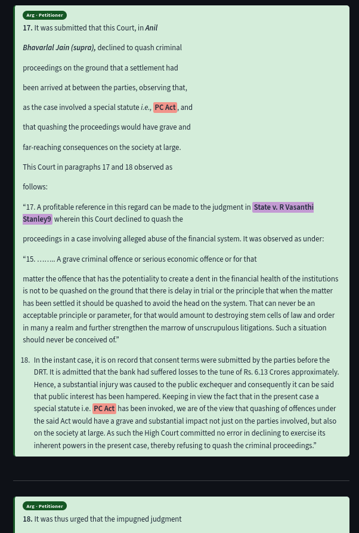

---

## Setup

See [SETUP.md](SETUP.md) for installation, environment configuration, and ingestion instructions.

---

## Architecture

The backend is a FastAPI server (`backend/main.py`) with six endpoints, using Ollama-hosted LLMs, FAISS + BM25 for per-document retrieval, a cross-encoder reranker, spaCy legal NER, and Qdrant Cloud for the similar-case index. The frontend is a Streamlit app consuming JSON and SSE streams over `httpx`.

For a complete project overview and walkthrough see [Presentation.pptx](Presentation.pptx).
